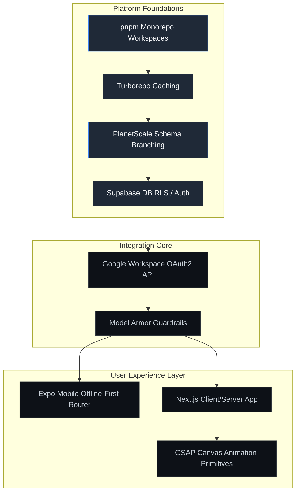

# OMEGA Capability Intelligence Graph
## Enterprise Competence Mapping & Unified Discovery System

This document maps all extracted engineering and organizational capabilities across the 250+ audited subdirectories within the skill-set repository, establishing the definitive taxonomy for the OMEGA platform.

---

## 1. Unified Capability Taxonomy Matrix

The following matrix organizes the fragmented capabilities into standard enterprise-grade modules, assigning ownership to specific executive subagents.

| Extracted Repository Capability | Legacy Skill Source | Target Domain Category | Supervising Agent | Integration Standard |
| :--- | :--- | :--- | :--- | :--- |
| **GWS Integration Services** | `gws-*`, `recipe-*` | Automation / Workspace | CTO Agent | Google REST API v3, OAuth2 |
| **Animation Choreography** | `gsap-*`, `design-*`| Frontend Design | UX / Frontend Agent | High-performance Canvas/DOM |
| **Mobile Core & Navigation** | `expo-*`, `clerk-expo`| Mobile Engineering | Mobile Agent | File-based Routing, Offline Sync |
| **Infrastructure & Build** | `vercel-*`, `planetscale`| DevOps & Platforms | Platform Eng. Agent | Monorepo pnpm workspaces |
| **Autonomous Scanners**| `shannon`, `security` | Cybersecurity | Security Agent | OWASP Threat Top 10, mTLS |
| **Cost & Token Reduction**| `cost-reducer`, `rtk` | FinOps & Context | Token/Cost Agent | RTK Command Prefixes |

---

## 2. Capability Intelligence Hierarchy

The capability layout below illustrates the dependency paths, showing how foundational platform layers support front-facing application layers.



---

## 3. Standard Capability Contracts

Each capability registers a strict JSON-Schema-style interface to prevent functional duplication.

### 3.1. Google Workspace (GWS) Interaction Standard
```json
{
  "$schema": "http://json-schema.org/draft-07/schema#",
  "title": "GWSWorkspaceInteractionContract",
  "type": "object",
  "properties": {
    "service": { "type": "string", "enum": ["gmail", "sheets", "calendar", "drive"] },
    "operation": { "type": "string" },
    "auth": {
      "type": "object",
      "properties": {
        "client_email": { "type": "string" },
        "scopes": { "type": "array", "items": { "type": "string" } }
      },
      "required": ["client_email", "scopes"]
    },
    "payload": { "type": "object" }
  },
  "required": ["service", "operation", "auth", "payload"]
}
```

### 3.2. Motion Choreography Standard (GSAP Hooks)
```json
{
  "$schema": "http://json-schema.org/draft-07/schema#",
  "title": "MotionChoreographyContract",
  "type": "object",
  "properties": {
    "targetSelector": { "type": "string" },
    "animationType": { "type": "string", "enum": ["scroll", "fade", "transform", "path"] },
    "duration": { "type": "number", "minimum": 0 },
    "easing": { "type": "string" },
    "triggers": {
      "type": "object",
      "properties": {
        "scrollTrigger": { "type": "boolean" },
        "start": { "type": "string" }
      }
    }
  },
  "required": ["targetSelector", "animationType", "duration"]
}
```

---

## 4. Capability Audit & Lifecycle Registry
To prevent capabilities from fracturing, OMEGA tracks the status of each capability:

- **Active**: Extracted, validated, and embedded into OMEGA references.
- **Deprecated**: Replaced by unified modular versions inside OMEGA.

| Module | Legacy ID | Status | Replacement Module inside OMEGA |
| :--- | :--- | :--- | :--- |
| `gws-gmail-send` | `gmail-send` | **Deprecated** | `19-google-workspace.md` (Unified Mail Service) |
| `gsap-scrolltrigger` | `scrolltrigger` | **Deprecated** | `04-frontend.md` (Motion & Choreography Layer) |
| `cost-reducer` | `reducer` | **Deprecated** | `13-token-cost.md` (FinOps & Token Rightsizer) |
| `shannon` | `shannon` | **Deprecated** | `07-security.md` (Cybersecurity Auditing) |
