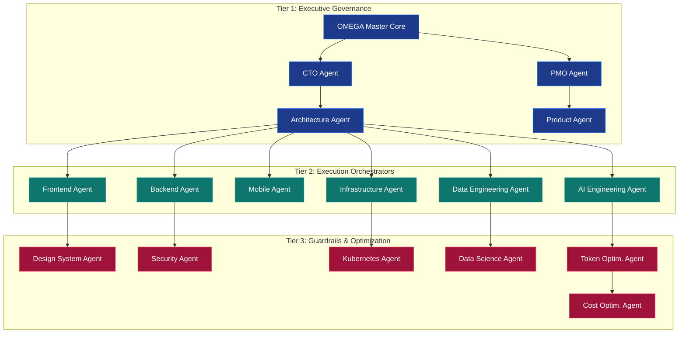

# OMEGA Orchestration Intelligence Graph
## Multi-Agent Execution Flow & Runtime Routing Protocol

This document maps out the operational flows, interaction patterns, and triggering sequences across the **30 executive subagents** of OMEGA, ensuring zero orchestration waste and optimal context handling.

---

## 1. Multi-Agent Hierarchy & Topology

The OMEGA organization operates on a three-tier hierarchical architecture, routing requests from the PMO and CTO layers down to highly specialized execution cells.



---

## 2. Interaction Protocol & Context Isolation

To conserve token space, OMEGA bans arbitrary peer-to-peer agent communications. Agents must interact via the **Unified Agent Event Hub** adhering to clear input/output types.

### 2.1. Context Passing Standard
When a parent agent spawns a subagent, it passes a structured **Execution Context Frame**:

```typescript
interface AgentExecutionContextFrame {
  parentConversationId: string;
  subagentId: string;
  scope: {
    targetFiles: string[];
    readOnly: boolean;
    allocatedTokens: number;
  };
  variables: Record<string, string>;
  dependencies: string[];
}
```

---

## 3. Runtime Phase Routing

The OMEGA multi-agent engine coordinates work through sequential gating stages aligned with the 20-Phase Execution Framework:

```
[Initialization] → PMO Agent detects workflow signal
        │
        ▼
[Planning Phase] → CTO & Architecture Agent draft ADRs & HLDs
        │
        ▼
[Security Check] → Security Agent validates threat model & access rules
        │
        ▼
[Execution Phase]→ Frontend/Backend/Mobile Agents run parallel generation
        │
        ▼
[Validation Phase]→ QA & Observability Agents check coverage & SLO thresholds
        │
        ▼
[Optimization]   → Token & Cost Agents rightsize context and runtimes
```

---

## 4. Subagent Catalog & Routing Conditions

| Subagent Name | System ID | Triggers on | Direct Output | Banned Actions |
| :--- | :--- | :--- | :--- | :--- |
| **CTO Agent** | `omega-cto` | Core architectural decisions, major design choices | Tech Stack ADRs, Design Rules | Coding directly |
| **PMO Agent** | `omega-pmo` | Task breakdown, sprint orchestration | `task.md` generation, phase updates | Modifying infrastructure |
| **Architecture Agent**| `omega-arch` | High/Low-Level designs | `HLD.md`, `LLD.md`, schema diagrams | Implementing styles |
| **Security Agent** | `omega-security` | RBAC setup, CSP/CORS changes, secrets handling | Threat Models, Compliance checklists| Bypassing gates |
| **Token Optim. Agent**| `omega-token` | High context usage, before terminal execution | RTK command recommendations | Ignoring cost constraints|
| **Cost Optim. Agent** | `omega-cost` | Infrastructure configurations, database schema | AWS/Vercel sizing recommendations | Compromising performance |
