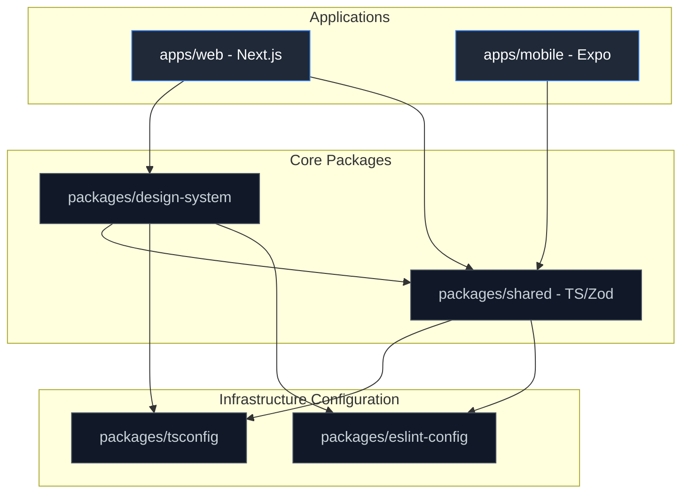

# OMEGA System Dependency Graph
## Repository Monorepo Structure & Package Boundaries

This document establishes the package segregation model, workspace dependency paths, and boundary conditions enforced within the OMEGA monorepo ecosystem.

---

## 1. Monorepo Directory Architecture

OMEGA requires strict workspace partitioning. The codebase is organized into isolated workspaces using **pnpm workspaces** and **Turborepo** for caching and orchestrating operations.

```
/
├── apps/
│   ├── web/                 # Next.js frontend application (depends on shared, design-system)
│   ├── mobile/              # Expo React Native mobile client (depends on shared)
│   └── docs/                # Workspace documentation site & Obsidian portal
├── packages/
│   ├── design-system/       # Claude-style UI tokens, styles, primitives
│   ├── shared/              # Common utility functions, Zod validation models, API types
│   ├── tsconfig/            # Centralized TypeScript base configurations
│   └── eslint-config/       # Unified Biome/ESLint code standards
├── services/
│   ├── api-gateway/         # NestJS gateway service (routes requests, handles auth)
│   ├── ai-orchestration/    # Python LangGraph/Model Armor pipeline
│   └── worker-pool/         # Go background processing service
├── infra/
│   ├── docker/              # Multi-stage Docker definitions
│   ├── k8s/                 # Kubernetes Helm charts & YAML configurations
│   └── terraform/           # IaC modules for cloud infrastructure provisioning
└── obsidian-vault/          # Centralized knowledge base and sprint logs
```

---

## 2. Dependency Flow Map

To prevent architectural drift and tight coupling, dependency relationships must flow downstream only.



---

## 3. Workspace Boundary Access Rules

To guarantee strict loose-coupling, OMEGA enforces import rules via ESLint / Biome boundary controls:

1. **Applications (`apps/*`)** may never import from other applications.
2. **Services (`services/*`)** must communicate via standardized RPC or messaging interfaces (REST, gRPC, Kafka) rather than local direct file sharing.
3. **Core Packages (`packages/*`)** must never depend on applications.
4. **Shared Package (`packages/shared`)** must remain pure and free from specific Node.js, DOM, or React runtime dependencies, ensuring compile-time compatibility with both Next.js and Expo environments.

---

## 4. Turborepo Orchestration Configuration

Our `turbo.json` file guarantees optimal build caching and parallel task execution.

```json
{
  "$schema": "https://turbo.build/schema.json",
  "globalDependencies": ["**/.env.*local"],
  "tasks": {
    "build": {
      "dependsOn": ["^build"],
      "outputs": [".next/**", "dist/**"]
    },
    "lint": {
      "dependsOn": ["^lint"],
      "outputs": []
    },
    "test": {
      "dependsOn": ["build"],
      "outputs": ["coverage/**"]
    },
    "dev": {
      "cache": false,
      "persistent": true
    }
  }
}
```
