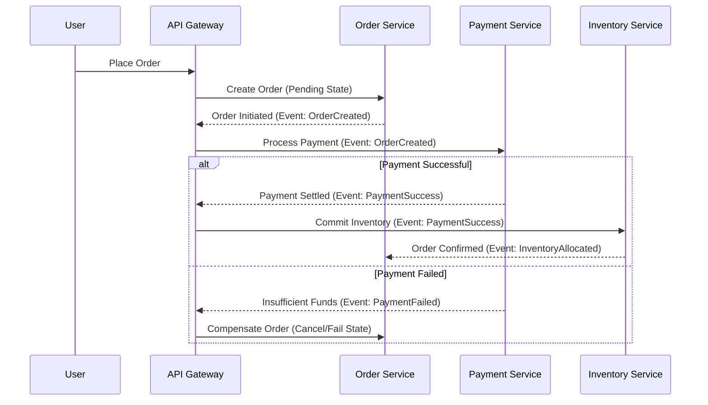

# OMEGA Architecture Intelligence Report
## Hexagonal Patterns, DDD, CQRS, & Distributed Transaction Standards

This document establishes the architecture blueprint, service boundaries, and state synchronization models for high-performance and resilient operations within the OMEGA ecosystem.

---

## 1. Domain-Driven Design (DDD) & Bounded Contexts

OMEGA segregates domains into isolated Bounded Contexts. Every domain context enforces a clear boundary between internal domain models and external transport layers.

```
                    ┌──────────────────────────────────────────────┐
                    │               Bounded Context                │
                    │                                              │
                    │   ┌──────────────────────────────────────┐   │
                    │   │              Transport               │   │
                    │   │        (GraphQL / REST / gRPC)       │   │
                    │   └──────────────────┬───────────────────┘   │
                    │                      │ (DTOs)                │
                    │                      ▼                       │
                    │   ┌──────────────────────────────────────┐   │
                    │   │          Application Services        │   │
                    │   │        (Command/Query Handlers)      │   │
                    │   └──────────────────┬───────────────────┘   │
                    │                      │                       │
                    │                      ▼                       │
                    │   ┌──────────────────────────────────────┐   │
                    │   │             Domain Model             │   │
                    │   │      (Entities, Value Objects)       │   │
                    │   └──────────────────────────────────────┘   │
                    └──────────────────────────────────────────────┘
```

### Domain Segregation Rules
- **Entities**: Objects possessing a unique identity that persists across execution stages.
- **Value Objects**: Immutable attributes containing structural data with zero identities (e.g., Currency, Address).
- **Aggregates**: A cluster of domain objects treated as a single data transactional unit. All database access must pass through the **Aggregate Root**.

---

## 2. Hexagonal (Ports & Adapters) Architecture

To decouple business logic from framework and infrastructure changes (e.g., switching from Postgres to Supabase or MongoDB), services enforce strict dependency inversion.

```
                  Adapters (In)              Ports               Core Domain
               ┌─────────────────┐    ┌─────────────────┐    ┌─────────────────┐
               │   HTTP Controller│───►│   UseCase Port  │───►│   Domain logic  │
               └─────────────────┘    └─────────────────┘    │  (Entities &    │
                                                             │   Aggregates)   │
               ┌─────────────────┐    ┌─────────────────┐    │                 │
               │   gRPC Listener │───►│   UseCase Port  │───►│                 │
               └─────────────────┘    └─────────────────┘    └────────┬────────┘
                                                                      │
                  Adapters (Out)             Ports                    │
               ┌─────────────────┐    ┌─────────────────┐             │
               │   Postgres Repo │◄───│  Database Port  │◄────────────┘
               └─────────────────┘    └─────────────────┘
```

- **Ports**: TS/Go interfaces declaring inputs and outputs (e.g., `UserRepositoryPort`).
- **Adapters**: Concrete infrastructure implementations (e.g., `SupabaseUserRepositoryAdapter`).

---

## 3. CQRS (Command Query Responsibility Segregation)

For read-heavy and high-concurrency systems, OMEGA segregates state modification from data query paths.

```
                         ┌──────────────┐
                         │ API Gateway  │
                         └──────┬───────┘
                     ┌──────────┴──────────┐
                     ▼                     ▼
               [Command Path]        [Query Path]
                     │                     │
                     ▼                     ▼
               NestJS Command        Direct Read DTO
                     │                     │
                     ▼                     ▼
               PostgreSQL Write       Redis Cache Read
```

- **Write Datastore (Postgres)**: Optimised for transaction processing, ACID compliance, and relational validation.
- **Read Datastore (Redis/ElasticSearch)**: Optimised for fast, low-latency, de-normalized read projections. State is synced asynchronously via event handlers.

---

## 4. Distributed Transactions (Saga Pattern)

When executing processes that span multiple microservices, OMEGA requires the **Choreography-based Saga Pattern** to ensure eventual consistency.



---

## 5. Architectural Quality Checks & Drift Detection

Every architectural component must undergo automated gate-validation:

1. **Circular Dependency Check**: Verified on build stages using static code analysis tools.
2. **Coupling Index**: High coupling (> 8 class connections per handler) prompts immediate PMO-directed refactoring.
3. **Database Escape Gate**: Raw queries inside controllers are strictly banned. All DB operations must pass through the declared Database Adapter.
