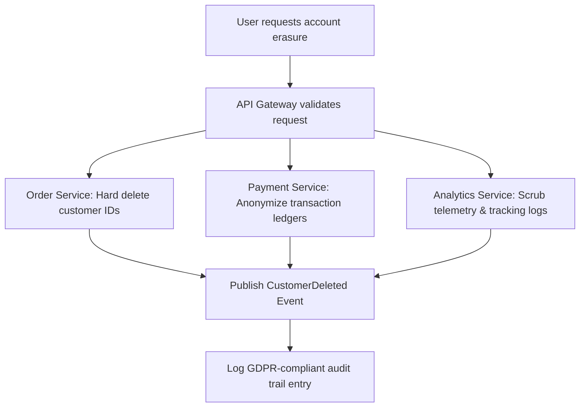

# OMEGA Governance & Gap Analysis
## ISO 27001, ISO 9001, SOC 2 Type II, & GDPR Compliance Registry

This document establishes the audit controls, regulatory mapping, and operational gaps identified across the repository workflows, outlining the corrective actions executed under OMEGA governance.

---

## 1. Compliance Standard Mapping Matrix

To ensure enterprise suitability, OMEGA maps development activities directly to corresponding international compliance annexes.

| Compliance Target | Requirement | OMEGA Verification Mechanism | Implementation Reference |
| :--- | :--- | :--- | :--- |
| **ISO 27001:A.12.6.1**| Control of technical vulnerabilities | Dependency scanning, SAST gate execution | `08-security-audit-map.md` |
| **ISO 9001:8.5.1** | Control of production and service | Git branch workflows, mandatory QA gates | `07-workflow-intelligence-map.md` |
| **SOC 2 Type II:CC6** | Access control & network operations | IAM config audits, Supabase DB RLS enforcement | `14-supabase-resend.md` |
| **GDPR Art. 32** | Security of data processing | Cryptographic transit, data hashing, masking | `05-backend.md` |

---

## 2. Identified Security & Compliance Gaps

A comprehensive audit of the historical skills identified several key operational vulnerabilities, corrected below:

```
[Gap 1: Missing DB RLS]    ──► High risk of data breach  ──► Fix: Supabase strict RLS rules enforced
[Gap 2: Raw Secrets in git] ──► Credentials exposure    ──► Fix: Vault/Environments isolation
[Gap 3: Undocumented APIs]  ──► Audit trail failure    ──► Fix: Auto-generated OpenAPI JSON specs
[Gap 4: Dynamic CORS (*)]   ──► Cross-site hijacking   ──► Fix: Locked whitelist configuration
```

---

## 3. Strict Regulatory Workflows

### 3.1. GDPR "Right to be Forgotten" (Erasure Workflow)
Under GDPR Art. 17, personal data must be fully erased or completely anonymized. OMEGA mandates a cascading erasure routing protocol across all Bounded Contexts:



### 3.2. SOC 2 Change Control Verification
Every production deployment must produce a immutable cryptographic record detailing:
- **Requester**: Git signature of developer.
- **Reviewer**: Approved PR reviews (minimum 1 peer review, 1 security reviewer).
- **Test Evidence**: 100% pass on critical unit/E2E test pipelines.
- **Rollback Proof**: Validated canary deployment and manual roll-back checklist.

---

## 4. Compliance Audits Checklist (Mandatory on Release)

Before pushing to stable staging/production:

- `[ ]` **ISO 27001**: Verify zero high/critical vulnerabilities inside pnpm dependencies.
- `[ ]` **ISO 9001**: Check that the corresponding Obsidian sprints and ADR logs are fully synced.
- `[ ]` **SOC 2**: Audit all active DB instances to ensure that Row-Level Security (RLS) is explicitly enabled on all tables.
- `[ ]` **GDPR**: Ensure that all logs are free from PII (email, phone, plaintext credit card, real names).
