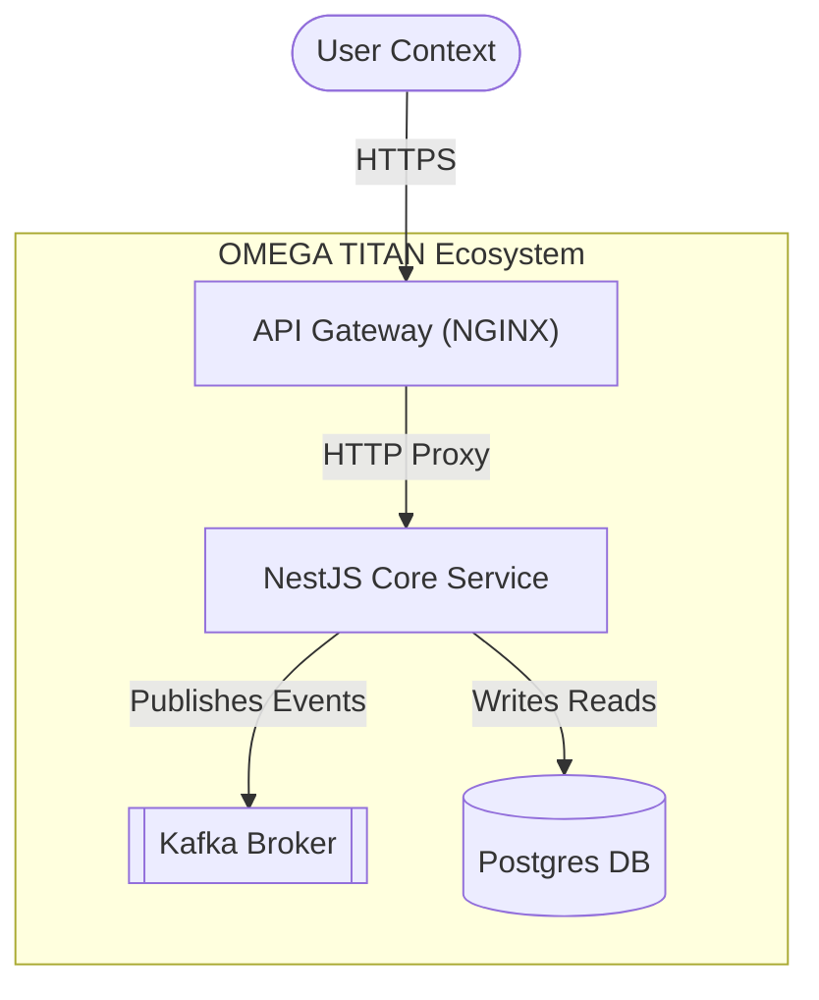
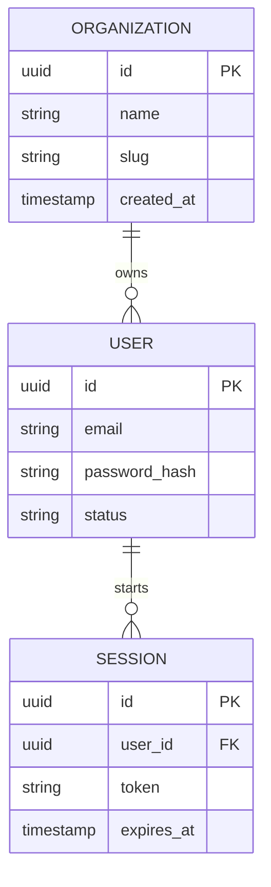
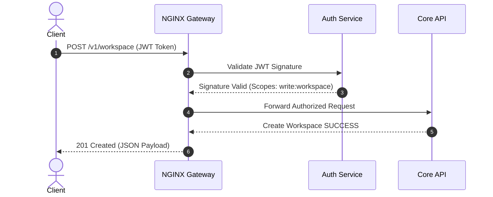
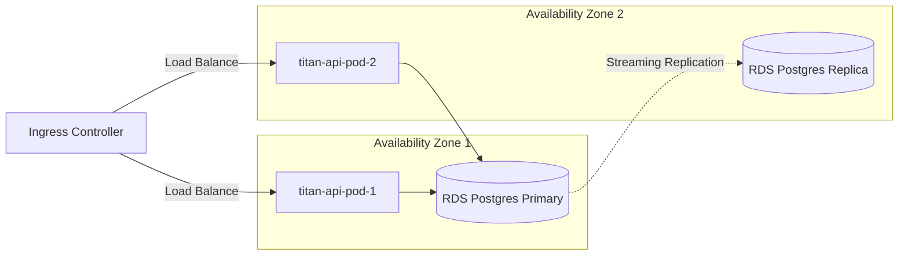

# Mermaid & Architecture Diagram Reference

## Table of Contents
1. [Syntax Integrity Rules (Error Prevention)](#syntax-rules)
2. [C4 Container Models](#c4-models)
3. [Entity Relationship Diagrams (ERDs)](#erds)
4. [Sequence & Interaction Diagrams](#sequence)
5. [Kubernetes Topology Diagrams](#kubernetes-topologies)

---

## 1. Syntax Integrity Rules (Error Prevention) {#syntax-rules}

To prevent Mermaid parsing failures in Markdown viewers:

*   **Quote Special Characters**: Labels containing parentheses, brackets, or punctuation must be explicitly wrapped in double quotes. E.g. `id["Label (Extra Info)"]` instead of `id[Label (Extra Info)]`.
*   **Avoid HTML Tags**: Never inject raw HTML (` `, `<b>`, `<i>`) inside node labels. Use Mermaid native string manipulation or formatting instead.
*   **Decouple Node Names from Labels**: Define clean node IDs (e.g. `webApp`, `postgresDb`) and map labels separately (`webApp["Web Application"]`).

---

## 2. C4 Container Models {#c4-models}

C4 container models show the high-level boundary of software systems and how containers communicate.

---

## 3. Entity Relationship Diagrams (ERDs) {#erds}

Use standard crow's foot notation (`||--o{`) to represent database relational mappings.

---

## 4. Sequence & Interaction Diagrams {#sequence}

Use sequence diagrams to clarify asynchronous tasks, API gateways, and authorization pipelines.

---

## 5. Kubernetes Topology Diagrams {#kubernetes-topologies}

Use topology flowcharts to design pod communication, routing paths, and multi-zone failovers.

