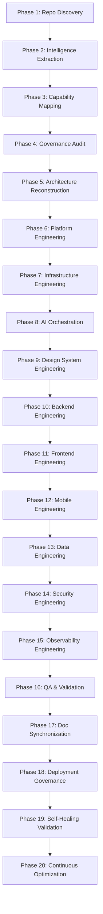
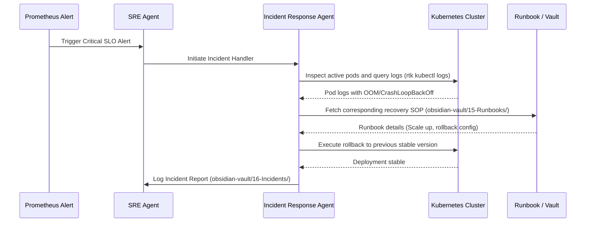

# OMEGA Workflow Intelligence Map
## Golden Paths for Greenfield, Feature Additions, SRE Recovery, & Performance Tuning

This document diagrams the standard operational procedures (SOPs) and golden paths executed by OMEGA for typical engineering activities.

---

## 1. Greenfield Project Development (Phase 1 to 20)

Developing a greenfield project requires strict adherence to all 20 phases. Shortcuts are strictly prohibited.



---

## 2. Feature Addition Golden Path

Adding a feature to an existing codebase requires a highly targeted workflow to ensure backward compatibility and prevent regression:

```
[Phase 5: Architecture]  ──► Create detailed ADR & update schema configurations
        │
        ▼
[Phase 16: QA TDD Red]   ──► Write failing Playwright/Vitest test scripts
        │
        ▼
[Phase 10/11: Implement] ──► Implement logic in packages/apps workspace
        │
        ▼
[Phase 16: QA TDD Green] ──► Execute 'rtk test' validation checks
        │
        ▼
[Phase 17: Doc Update]   ──► Sync Obsidian Vault records and update Runbooks
```

---

## 3. SRE Recovery Workflow (Emergency Protocol)

In the event of production crashes or service disruptions, OMEGA initiates a strict recovery protocol:



---

## 4. Performance Tuning / Optimization Loop

When high-latency or slow-queries are detected:

1. **Profile**: Run observability checks to locate the bottleneck (e.g., database slow queries, bloated bundles, high-cardinality logging).
2. **Design Patch**: Formulate an optimization patch (e.g., adding index, caching-aside, tree-shaking).
3. **Validate**: Execute automated benchmark tests (`rtk vitest` or k6 load scripts) to prove performance improvements.
4. **Publish**: Deploy the patch, and record results.

---

## 5. Standard Code Cleanup Pipeline (Multi-Stage Cleanup) {#cleanup-pipeline}
> Distilled from `claude-starter`

Before any release build, OMEGA executes a sequential, multi-stage cleanup pipeline to eradicate technical debt and maintain structural sanity.

### Order of Execution (Destructive → Constructive → Cosmetic)
If any step fails, the pipeline halts immediately.

```
[Start: cleanup-all]
        │
        ▼
[Stage 1: unused]     ──► Remove unused imports, dead variables, unreachable code
        │
        ▼
[Stage 2: cycles]     ──► Detect and break circular file/module dependency loops
        │
        ▼
[Stage 3: dedupe]     ──► Merge identical blocks and helper wrappers into shared packages
        │
        ▼
[Stage 4: types]      ──► Elevate weak or 'any' types to strict, documented interfaces
        │
        ▼
[Stage 5: defensive]  ──► Enforce runtime try/catch gates and sanitization layers
        │
        ▼
[Stage 6: legacy]     ──► Upgrade older runtime versions and deprecated patterns
        │
        ▼
[Stage 7: slop]       ──► Format files using biome/prettier and strip verbose logs
```

---

## 6. External Skill Discovery & Installation Policy {#skills-install}
> Distilled from `vercel-labs/skills.git` (find-skills)

To prevent duplication and guarantee reliability, OMEGA uses a strict validation framework before installing or recommending third-party skills.

### Discovery Protocol
If a task requires capabilities not present in OMEGA's native references:
1. Search the marketplace: `npx skills find [query]`.
2. Evaluate trust signals:
   - **Trusted Authors**: `vercel-labs`, `anthropics`, `microsoft`
   - **Quality threshold**: Stars ≥ 100 on the source repository
   - **Install safety**: Preferred install count ≥ 1K (be highly cautious below 100)
3. If trusted, present the command to the user for one-click installation:
   `npx skills add <owner/repo> -g -y`
4. If no reliable ecosystem skill exists, scaffold a custom skill via:
   `npx skills init <skill-name>`
